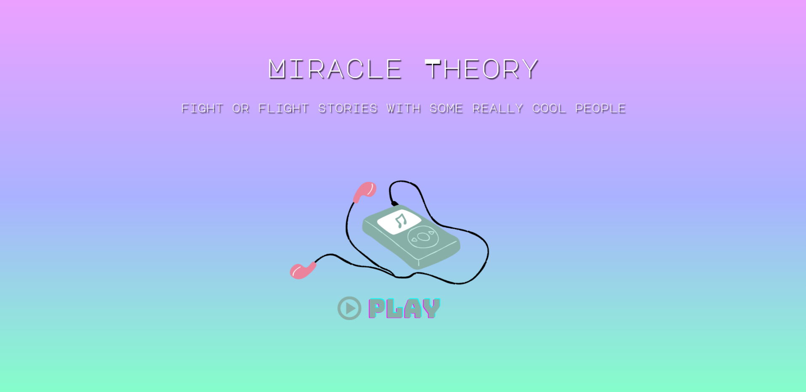
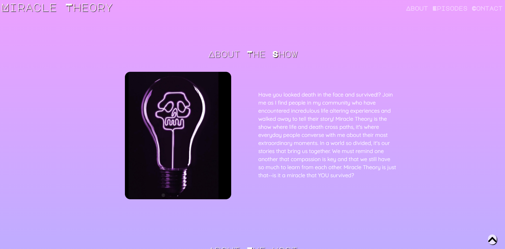
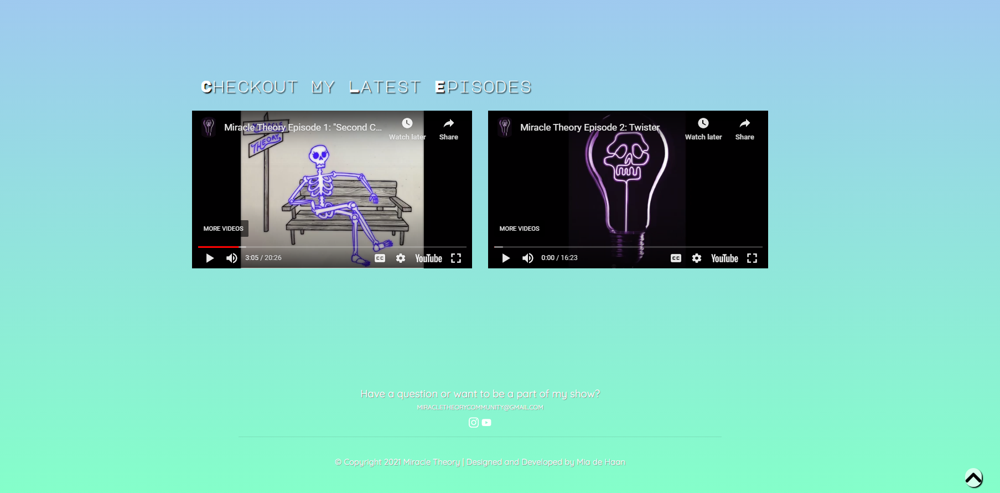
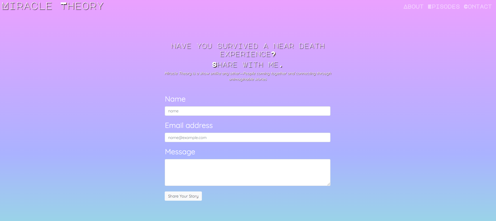

# My Portfolio

## Description 

This webpage was created for my client's Youtube Channel to showcase episodes, provide information about the show, and exposes her brand past the scope of just Youtube. This site also serves as a communication tool for viewers and subscribers to directly contact her with their own stories to be featured on the show.
This application utilizes ReactJS, Bootstrap, and Firebase. 

## Table of Contents
- [Description](#Description)
- [Links](#Links)
- [Technologies](#Technologies)
- [Application](#Application)
- [Questions](#Questions)
- [License](#License)

## Links

Deployed Application: https://miracletheorywebsite.web.app/ 

Github Repository: https://github.com/miadehaan/MiracleTheory 

## Technologies

**Tech/Framework Used/Tech Stack**

- HTML
- CSS
- Bootstrap Framework
- React JS
- Firebase

## Application

## Questions
If you have any questions, please contact me at the email below. Check out my Github portfolio for more of my projects!

- Github Username: miadehaan
- Github Portfolio: (https://miadehaan.github.io/)
- Github Email: (mariannedehaan14@gmail.com)

## License

[MIT License](LICENSE)